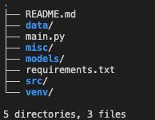
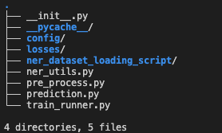

Custom Data Capturing Pipeline
======================
Version 1.1

#### Requirements & Setup

- transformers_version: 4.16.2
- framework: PyTorch
- framework_version: 1.10.2
- python_version: 3.7.12
- system: Linux
- ubuntu version: Ubuntu 20.04
- cpu: x86_64
- cuda version: 10.1
- architecture: 64bit
- fp16: True
- use_multiprocessing: True
- use_gpu: True
- num_gpus: 1
- gpu: Tesla T4  15GB
- gitflow
- auto versioning
- auto reports for ml metrics

With VENV Create a new virtual environment and install packages.

    virtualenv -p python3 venv

    source ./venv/bin/activate

Install requirements in virtual environment

    pip3 install -r requirements.txt

    cd /src/custom_sb_optics/up_img_res

    git clone https://github.com/xinntao/Real-ESRGAN.git .

    pip install -r requirements.txt

    python setup.py develop

#### Repo Component Description & Dependencies

- Root component folders as seen in the image above contains end to end architechture and dependencies to enable training and deployment access to frontend 

- As seen above, the key pipeline building blocks includes data capturing architecture scripts such as:
    - [Data preprocessor script](src/custom_sb_optics/pre_process.py):
        - Contains annotator parser, data split for input full transcript list and annotated label dictionary data
            - todo: data augmentation
    - [Config arguments](src/custom_sb_optics/config/)
    - Losses for transformer neural network loss functions
    - Ner dataset loader for torch data loading implementation via huggingface
    - [Trainer script](src/custom_sb_optics/train_runner.py):
        - Contain NER architectural transformer for training clean custom data capture data on new document type features
    - [Predictor script](src/custom_sb_optics/prediction.py): 
        - For wrapping api endpoint for trained document type data capture via workspace and trained model weights

Test pipeline in your commandline using:

    python3 ./main.py

Model training dummy result variable output

    precision    recall  f1-score   support

    Address         0.2500    0.0667    0.1053        15
    Election_day    0.0000    0.0000    0.0000         7
    Name            0.0000    0.0000    0.0000         7
    eg_number       0.0000    0.0000    0.0000         2

    micro avg       0.0417    0.0323    0.0364        31
    macro avg       0.0625    0.0167    0.0263        31
    weighted avg    0.1210    0.0323    0.0509        31

    accuracy = 0.08888888888888889
    eval_loss = 2.3222237825393677
    f1_score = 0.03636363636363637
    precision = 0.041666666666666664
    recall = 0.03225806451612903

Model artefacts are folder contents in models/baseline/ folder. Every other folder should be deleted if model result threshold crosses 80% accuracy in result metrics measured else checkpoint should be used in continuous machine learning training CML

#### What next

- Backend deployment
- Review data structure for multiple file input requiring index per file saved in nested json
- Iteration various document scenario for higher accuracy
- Benchmark result implementation for backend communication with frontend or client as messaging to notify model training completion
- Integrate NLP spell checker for postprocessing